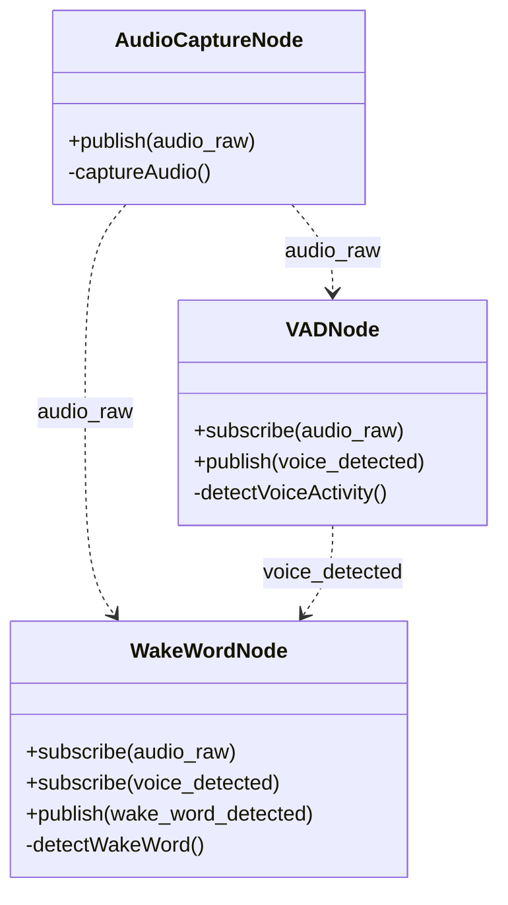
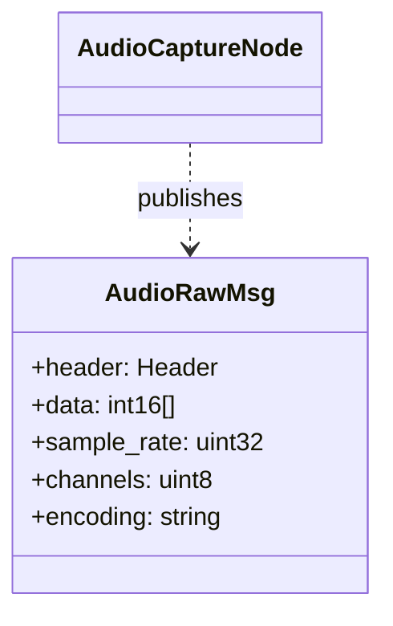
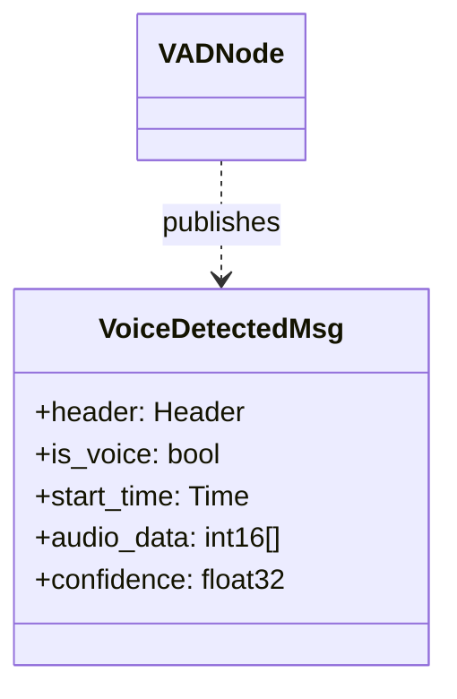
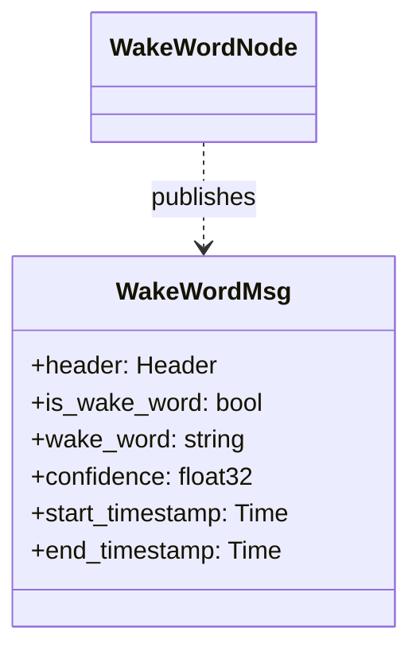

# Overview

## Project Structure
```
ros2_SDL2_audio_frontend/
├── docs/
│   ├── contributing/
│   │   ├── license.md
│   │   ├── rules.md
│   ├── usage/
│   │   ├── overview.md
│   │   ├── usage_with_linux.md
│   ├── index.md
├── sdl2_audio_frontend/
│   ├── config/
│   │   ├── audio_params.yaml
│   ├── include/
│   │   ├── sdl2_audio_frontend/
│   │   │   ├── audio/
│   │   │   │   ├── audio_async.hpp
│   │   │   ├── nodes/
│   │   │   │   ├── audio_capture_node.hpp
│   │   │   │   ├── audio_playback_node.hpp
│   │   │   │   ├── vad_node.hpp
│   │   │   │   ├── wake_word_node.hpp
│   ├── launch/
│   │   ├── audio_frontend.launch.py
│   ├── msg/
│   │   ├── AudioData.msg
│   ├── src/
│   │   ├── audio/
│   │   │   ├── audio_async.cpp
│   │   ├── nodes/
│   │   │   ├── audio_capture_node.cpp
│   │   │   ├── audio_playback_node.cpp
│   │   │   ├── vad_node.cpp
│   │   │   ├── wake_word_node.cpp
│   ├── CMakeLists.txt
│   ├── package.xml
├── LICENSE
├── README.md
```

## Class diagram



## Messages





