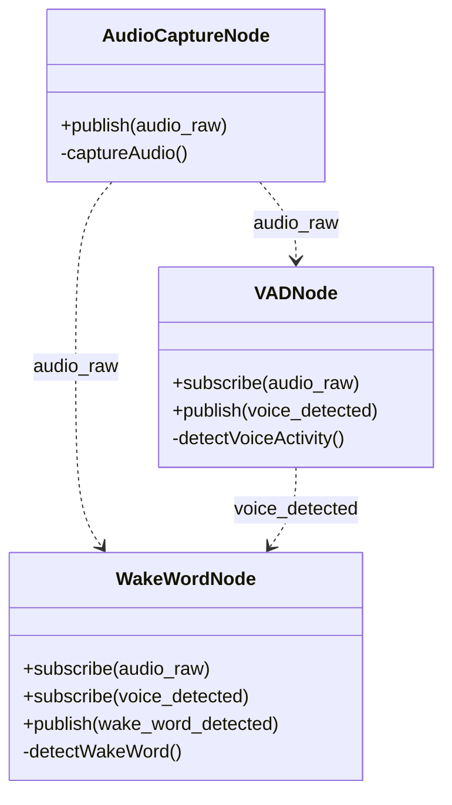
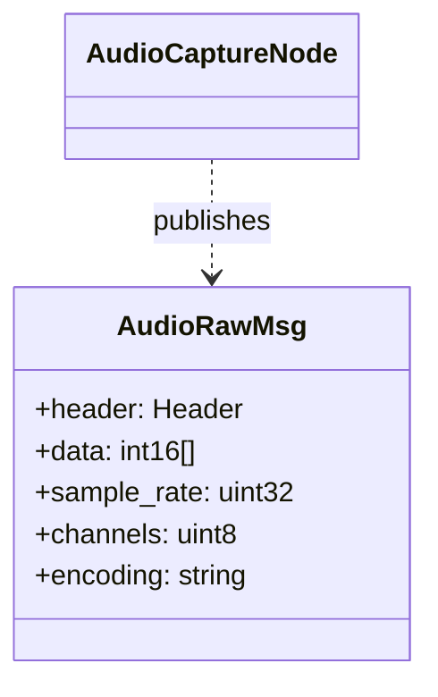
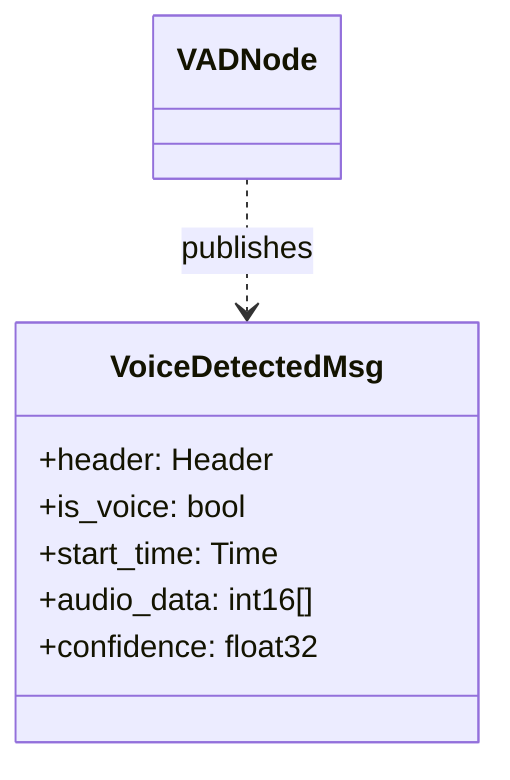
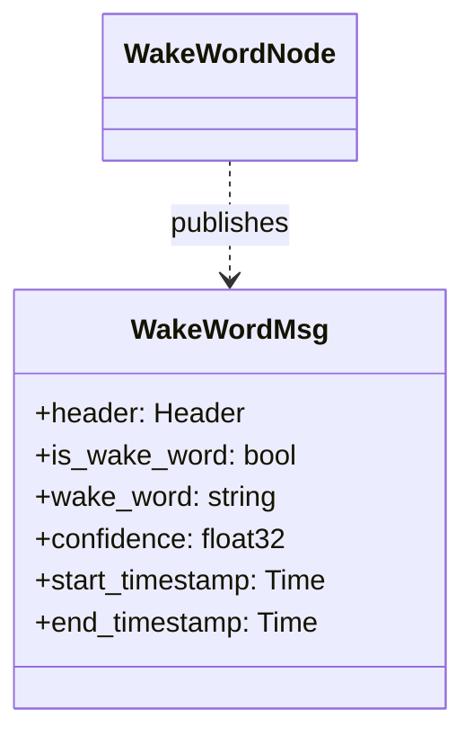

# Overview

## Class diagram

```mermaid
classDiagram
    class AudioCaptureNode {
        +publish(audio_raw)
        -captureAudio()
    }
    
    class VADNode {
        +subscribe(audio_raw)
        +publish(voice_detected)
        -detectVoiceActivity()
    }
    
    class WakeWordNode {
        +subscribe(audio_raw)
        +subscribe(voice_detected)
        +publish(wake_word_detected)
        -detectWakeWord()
    }
    

    AudioCaptureNode ..> VADNode : audio_raw
    AudioCaptureNode ..> WakeWordNode : audio_raw
    
    VADNode ..> WakeWordNode : voice_detected
```

## Messages

```mermaid
classDiagram
    %% Message Types
    class AudioRawMsg {
        +header: Header
        +data: int16[]
        +sample_rate: uint32
        +channels: uint8
        +encoding: string
    }
    AudioCaptureNode ..> AudioRawMsg : publishes
```

```mermaid
classDiagram
    %% Message Types
    class VoiceDetectedMsg {
        +header: Header
        +is_voice: bool
        +start_time: Time
        +audio_data: int16[]
        +confidence: float32
    }
    %% Node connections to messages
    VADNode ..> VoiceDetectedMsg : publishes
```    

```mermaid
classDiagram
    %% Message Types
    class WakeWordMsg {
        +header: Header
        +is_wake_word: bool
        +wake_word: string
        +confidence: float32
        +start_timestamp: Time
        +end_timestamp: Time
    }
    %% Node connections to messages
    WakeWordNode ..> WakeWordMsg : publishes
``` 

